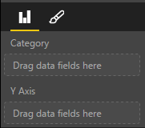

#Using Capabilities

Capabilities are used to provide information to the host about your visual.

Your visual's capabilities are loaded from

```json
{
    "dataRoles": [ ... ],
    
    "dataViewMappings": [ ... ],
    
    "objects":  { ... },
    
    "supportsHighlight": true|false,
    
    "sorting": { ... }
}

```


##Define the data fields your visual expects - `dataRoles`

To define fields that can be bound to data we use `dataRoles` which takes an array of `DataViewRole` objects which defines all of the properties needed.

###Properties

* **name** - the internal name of this data field (must be unique)
* **kind** - the kind of field:
    * 0 `Grouping` - Discrete values used for grouping of measure fields
    * 1 `Measure` - Numeric data values 
    * 2 `GroupingOrMeasure` - Can be used as either a grouping or measure
* **displayName** - the name displayed to the user in the properties pane
* **description** - a short description of the field (optional)

###Example

```json
[
    {
        "displayName": "Category Data",
        "name": "category",
        "kind": 0
    },
    {
        "displayName": "Measure Data",
        "name": "measure",
        "kind": 1
    }
]
```

The above data roles would create the following fields




##Define how you want the data mapped - `dataViewMappings`

A DataViewMapping describes how the data roles relate to each other and allows you to specify conditional requirements for the them.

Most visuals provide a single mapping, but you can provide multiple dataViewMappings. Each valid mapping will produce a DataView. 

```json
[
    {
        "conditions": [ ... ],
        "requiredProperties": [ ... ],
        "categorical": { ... },
        "table": { ... }
    }
]
```

[Learn more about dataViewMappings](dataViewMappings.md)


##Define property pane options - `objects`